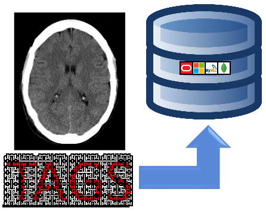

[](https://travis-ci.com/HicServices/DicomTypeTranslation) [](https://lgtm.com/projects/g/HicServices/DicomTypeTranslation/alerts/) [](https://buildstats.info/nuget/HIC.DicomTypeTranslation)

# DicomTypeTranslation

- [Nuget](https://www.nuget.org/packages/HIC.DicomTypeTranslation/)
- [Dependencies](./Packages.md)
- [Changelog](./CHANGELOG.md)


[Fo Dicom](https://github.com/fo-dicom/fo-dicom)/[FAnsiSql](https://github.com/HicServices/FAnsiSql) powered library for converting [dicom](https://www.dicomlibrary.com/dicom/) types into database/C# types at speed. The library lets you cherry pick specific tags from dicom images (e.g. PatientID) and populate a relational (or MongoDB) database with flat record results (e.g. 1 record per image). With DicomTypeTranslation you can create whatever schema works for you in whatever DBMS you want and then link it with existing EHR data you already have (E.g. by PatientID).

Also included is a DICOM to JSON converter, which aims to allow better coverage when converting "real world" DICOM data than the standard fo-dicom implementation. More details [here](docs/JsonDicomConverters.md).



Heres a simple worked example:

```csharp
//pick some tags that we are interested in (determines the table schema created)
var toCreate = new ImageTableTemplate(){
    Columns = new []{
        new ImageColumnTemplate(DicomTag.SOPInstanceUID),
        new ImageColumnTemplate(DicomTag.Modality){AllowNulls = true },
        new ImageColumnTemplate(DicomTag.PatientID){AllowNulls = true }
        } };
            
//load the Sql Server implementation of FAnsi
ImplementationManager.Load<MicrosoftSQLImplementation>();

//decide where you want to create the table
var server = new DiscoveredServer(@"Server=localhost\sqlexpress;Database=test;Integrated Security=true;",FAnsi.DatabaseType.MicrosoftSQLServer);
var db = server.ExpectDatabase("test");
            
//create the table
var tbl = db.CreateTable("MyCoolTable",toCreate.GetColumns(FAnsi.DatabaseType.MicrosoftSQLServer));

//add a column for where the image is on disk
tbl.AddColumn("FileLocation",new DatabaseTypeRequest(typeof(string),500),true,500);

//Create a DataTable in memory for the data we read from disk
DataTable dt = new DataTable();
dt.Columns.Add("SOPInstanceUID");
dt.Columns.Add("Modality");
dt.Columns.Add("PatientID");
dt.Columns.Add("FileLocation");

//Load some dicom files and copy tag data into DataTable (where tag exists)
foreach(string file in Directory.EnumerateFiles(@"C:\temp\TestDicomFiles","*.dcm", SearchOption.AllDirectories))
{
    //open using FoDicom
    var dcm = DicomFile.Open(file);
    var ds = dcm.Dataset;
             
    //add one row per file
    dt.Rows.Add(
        DicomTypeTranslaterReader.GetCSharpValue(dcm.Dataset,DicomTag.SOPInstanceUID),
        ds.Contains(DicomTag.Modality)? DicomTypeTranslaterReader.GetCSharpValue(dcm.Dataset,DicomTag.Modality):DBNull.Value,
        ds.Contains(DicomTag.PatientID)? DicomTypeTranslaterReader.GetCSharpValue(dcm.Dataset,DicomTag.PatientID):DBNull.Value,
        file);
}

//upload records to database
using(var insert = tbl.BeginBulkInsert())
    insert.Upload(dt);
```

This results in the following table (with sensible datatypes):


## Installing Nuget Package

You can install the library via NuGet Package Manager:
```
PM> Install-Package HIC.DicomTypeTranslation
```

Or use the .Net CLI:

```
> dotnet add package HIC.DicomTypeTranslation
```

## The Dicom Specification
Dicom is a complex specification that includes many data types and data structures (e.g. trees, arrays).  The following section describes how these issues are addressed by DicomTypeTranslation.

### Reading Types

One goal of this library is high speed reading of strongly typed values from dicom tags.  This is handled by the static class `DicomTypeTranslaterReader`.

Consider the following example dataset (FoDicom):

```csharp
var ds = new DicomDataset(new List<DicomItem>()
{
    new DicomShortString(DicomTag.PatientName,"Frank"),
    new DicomAgeString(DicomTag.PatientAge,"032Y"),
    new DicomDate(DicomTag.PatientBirthDate,new DateTime(2001,1,1))
});
```

We can read all these as follows:

```csharp
object name = DicomTypeTranslaterReader.GetCSharpValue(ds, DicomTag.PatientName);
Assert.AreEqual(typeof(string),name.GetType());
Assert.AreEqual("Frank",name);

object age = DicomTypeTranslaterReader.GetCSharpValue(ds, DicomTag.PatientAge);
Assert.AreEqual(typeof(string),age.GetType());
Assert.AreEqual("032Y",age);

object dob = DicomTypeTranslaterReader.GetCSharpValue(ds, DicomTag.PatientBirthDate);
Assert.AreEqual(typeof(DateTime),dob.GetType());
Assert.AreEqual(new DateTime(2001,01,01), dob);
```

### Multiplicity

The Dicom specification allows multiple elements to be specified for some tags, this is called 'multiplicity':

```csharp
//create an Fo-Dicom dataset with string multiplicity
var ds = new DicomDataset(new List<DicomItem>()
{
    new DicomShortString(DicomTag.PatientName,"Frank","Anderson")
});
```

We represent multiplicity as arrays:

```csharp

object name2 = DicomTypeTranslaterReader.GetCSharpValue(ds, DicomTag.PatientName);
Assert.AreEqual(typeof(string[]),name2.GetType());
Assert.AreEqual(new string[]{"Frank","Anderson"},name2);
```

If you don't want to deal with arrays you can flatten the result:

```csharp
name2 = DicomTypeTranslater.Flatten(name2);
Assert.AreEqual(typeof(string),name2.GetType());
Assert.AreEqual("Frank\\Anderson",name2);
```

## Sequences

The Dicom specification allows trees too, these are called Sequences.  A Sequence consists of 1 or more sub datasets.

```csharp
//The top level dataset
var ds = new DicomDataset(new List<DicomItem>()
{
    //top level dataset has a normal tag
    new DicomUniqueIdentifier(DicomTag.SOPInstanceUID,"1.2.3"), 

    //and a sequence tag
    new DicomSequence(DicomTag.ActualHumanPerformersSequence,new []
    {
        //sequnce tag is composed of two sub trees:
        //subtree 1
        new DicomDataset(new List<DicomItem>()
        {
            new DicomShortString(DicomTag.PatientName,"Rabbit")
        }), 

        //subtree 2
        new DicomDataset(new List<DicomItem>()
        {
            new DicomShortString(DicomTag.PatientName,"Roger")
        })
    })
});
```

We represent sequences as trees (`Dictionary<DicomTag,object>`):

```csharp
var seq = (Dictionary<DicomTag,object>[])DicomTypeTranslaterReader.GetCSharpValue(ds, DicomTag.ActualHumanPerformersSequence);
Assert.AreEqual("Rabbit",seq[0][DicomTag.PatientName]);
Assert.AreEqual("Roger",seq[1][DicomTag.PatientName]);
```

Again if you don't want to deal with this you can just call Flatten:

```csharp
var flattened = DicomTypeTranslater.Flatten(seq);
```

The Flattened (string) representation of the above example is:
```
[0] - 
 	 (0010,0010) - 	 Rabbit

[1] - 
 	 (0010,0010) - 	 Roger
```

### Database Types

The Dicom specification has rules about how big datatypes can be (called ValueRepresentations) for example the entry for [Patient Address](http://northstar-www.dartmouth.edu/doc/idl/html_6.2/DICOM_Attributes.html) is LO ("Long String") which has a maximum length of 64 charactesr.

```csharp
var tag = DicomDictionary.Default["PatientAddress"];            
```

The library supports translating DicomTags into the matching [FAnsiSql](https://github.com/HicServices/FAnsiSql) common type representation:

```csharp
DatabaseTypeRequest type = DicomTypeTranslater.GetNaturalTypeForVr(tag.DictionaryEntry.ValueRepresentations,tag.DictionaryEntry.ValueMultiplicity);

Assert.AreEqual(typeof(string),type.CSharpType);
Assert.AreEqual(64,type.Width);
```

This `DataTypeRequest` can then be converted to the appropriate database column type:

```csharp
TypeTranslater tt = new MicrosoftSQLTypeTranslater();
Assert.AreEqual("varchar(64)",tt.GetSQLDBTypeForCSharpType(type));

tt = new OracleTypeTranslater();
Assert.AreEqual("varchar2(64)",tt.GetSQLDBTypeForCSharpType(type));
```

This lets you build adhoc database schemas in any DBMS (supported by FAnsi) based on arbitrary dicom tags picked by your users.

## Building

Building requires MSBuild 15 or later (or Visual Studio 2017 or later).  You will also need to install the DotNetCore 2.2 SDK.
